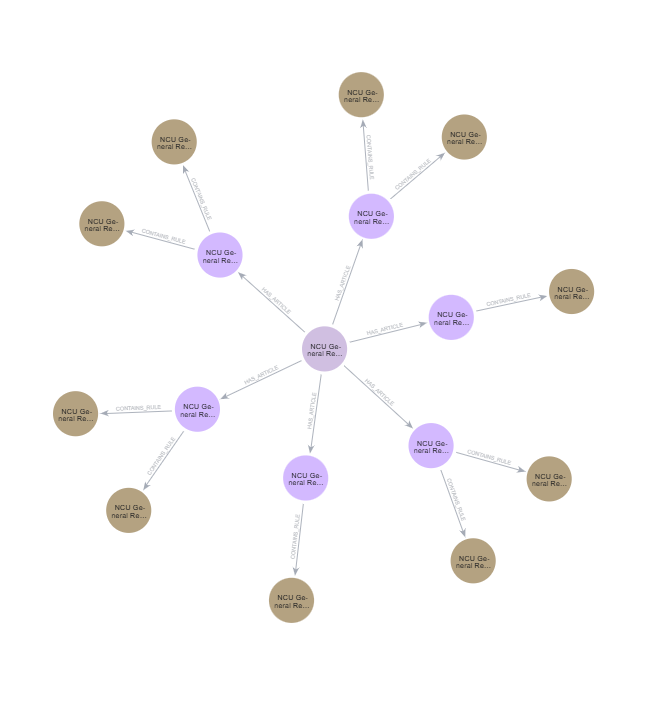
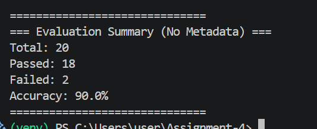

# NCU Regulation Assistant (GraphRAG)

## 1. Project Overview
This project implements a **Knowledge Graph-based Retrieval-Augmented Generation (GraphRAG)** system for National Central University (NCU) academic regulations. Unlike traditional Vector RAG, which relies solely on semantic similarity, this system utilizes a structured **Neo4j** knowledge graph to maintain the logical integrity of legal rules, significantly reducing hallucinations.

## 2. Knowledge Graph Schema Design
The system organizes information into a three-tier hierarchical structure to ensure precise navigation and logical reasoning:

* **Nodes:**
    * `Regulation`: The root node representing the specific law or set of rules (e.g., *NCU Student Examination Regulations*).
    * `Article`: Represents a specific article within a regulation, containing the raw text and article number.
    * `Rule`: The smallest logical unit extracted via LLM, structured into `Action` (the trigger condition) and `Result` (the legal consequence).
* **Relationships:**
    * `(:Regulation)-[:HAS_ARTICLE]->(:Article)`: Establishes hierarchy.
    * `(:Article)-[:CONTAINS_RULE]->(:Rule)`: Maps raw text to structured logic.

**Graph Visualization:**
The image below shows the "Star Schema" where a central Regulation connects to multiple Articles, which in turn branch out into specific Rule nodes.

## 3. Key Implementation Highlights
* **Two-Dimensional Retrieval Architecture:**
    * **Horizontal Dimension:** Full-text indexing on `Article` content and `Rule` attributes for precise keyword matching.
    * **Vertical Dimension:** Path-based jumping in Neo4j, allowing the agent to retrieve the full context of a rule by traversing back to its parent Article and Regulation.
* **Robust Extraction & Fallback Mechanism:** * Designed a custom **JSON Parser with Regex** to handle inconsistent outputs from the local 1.5B model.
    * Implemented a **Deterministic Fallback** system: If the LLM fails to extract rules, a "General Rule" node is created to ensure the Article remains searchable within the graph.
* **Hybrid Query Processing:** The system cleans the user's raw query and combines it with extracted keywords to balance high **Recall** (finding the right article) and high **Precision** (pinpointing the specific rule).

## 4. Evaluation Results
* **Query Accuracy:** **90.0%** (Passed 18 out of 20 test cases).

* **KG Coverage:** **128/159 articles (80.5%)**.
    * *Note:* The "uncovered" articles are primarily introductory or supplementary provisions (e.g., effective dates) that lack actionable "Action-Result" logic. This ensures the Knowledge Graph remains high-quality and noise-free.

## 5. Getting Started
1.  **Environment Setup:** `pip install -r requirements.txt`
2.  **Data Initialization:** Run `python setup_data.py` to prepare the SQLite database.
3.  **Build Knowledge Graph:** Run `python build_kg.py` (ensure Neo4j is running).
4.  **Run System:** Use `python query_system.py` for manual Q&A or `python auto_test.py` for evaluation.

---
*Developed as part of the NCU AI Master's Program - Assignment 4.*
